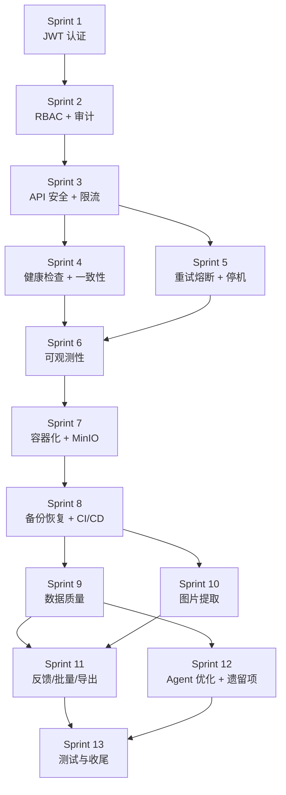

# 第四阶段任务书：产品化与生产就绪

## 概述

本任务书对应技术方案第七章，目标是将 AgenticRAG 从开发/测试状态提升到生产就绪。

里程碑：
- **M7**：安全加固（JWT + RBAC + 限流 + 审计）
- **M8**：可靠性（健康检查 + 数据一致性 + 重试熔断 + 优雅停机）
- **M9**：可观测性（请求日志 + Metrics + Tracing）
- **M10**：部署运维（容器化 + MinIO + 备份恢复 + CI/CD）
- **M11**：数据质量（文档校验 + 元数据补全 + Query 归一化 + 图片提取）
- **M12**：功能完善（反馈 + 批量操作 + 导出 + 评测 + 遗留项清理）

### 前置条件

- 第三阶段全部功能已交付并可用
- Agent 对话、RAG 问答、知识库管理三条链路端到端可用

---

## 任务清单

### Sprint 1：JWT 认证与用户体系（M7 前置）

| ID | 任务 | 产出 | 验收标准 |
|----|------|------|----------|
| P4-S1-01 | 用户表设计 | `users` 表（id, username, email, password_hash, role, is_active） | Alembic 迁移可执行 |
| P4-S1-02 | 注册/登录 API | `POST /auth/register`, `POST /auth/login` | 注册后可登录，返回 JWT |
| P4-S1-03 | JWT 签发与验证 | access token + refresh token 机制 | token 过期后可刷新，伪造 token 被拒绝 |
| P4-S1-04 | FastAPI 认证依赖 | `get_current_user` 依赖注入 | 未认证请求返回 401 |
| P4-S1-05 | 前端登录页面 | 登录表单 + token 存储（localStorage） | 登录后跳转首页，未登录重定向到登录页 |
| P4-S1-06 | CORS 配置收紧 | 环境变量控制 `ALLOWED_ORIGINS` | 生产环境只允许前端域名 |

### Sprint 2：RBAC 权限与审计（M7）

| ID | 任务 | 产出 | 验收标准 |
|----|------|------|----------|
| P4-S2-01 | 角色定义与权限装饰器 | `require_role("admin")` 装饰器 | admin/operator/user 三级权限生效 |
| P4-S2-02 | 管理后台权限限制 | 知识库/文档 API 限制 admin/operator | user 角色无法访问管理 API |
| P4-S2-03 | Agent 会话用户隔离 | chat_sessions 关联 user_id | 用户只能看到自己的会话 |
| P4-S2-04 | 知识库访问权限 | 知识库绑定可访问角色列表 | 未授权用户无法检索该知识库 |
| P4-S2-05 | 前端角色路由守卫 | 按角色显示/隐藏菜单和页面 | user 看不到管理后台入口 |
| P4-S2-06 | 审计日志表 | `audit_logs` 表 + Alembic 迁移 | 迁移可执行 |
| P4-S2-07 | 审计日志记录 | 关键操作自动记录（知识库/文档 CRUD、配置变更） | 操作后可在审计日志中查到 |
| P4-S2-08 | 审计日志查询 API | `GET /admin/audit_logs`（admin 可用） | 可按时间、用户、操作类型筛选 |

### Sprint 3：API 安全与限流（M7）

| ID | 任务 | 产出 | 验收标准 |
|----|------|------|----------|
| P4-S3-01 | Rate Limiting 中间件 | 基于 Redis 滑动窗口限流 | 超限返回 429，全局 100/min、Agent 10/min、RAG 20/min |
| P4-S3-02 | LLM API Key 安全 | 从 `.env` 迁移到环境变量注入 | Docker secrets / K8s secrets 方式注入 |
| P4-S3-03 | SQL 注入防护加固 | 补充注释绕过（`--`, `/**/`）检测 | 注释绕过尝试被拦截 |
| P4-S3-04 | 敏感操作二次确认 | 删除知识库/文档前端弹窗确认 | 误点不会直接删除 |

### Sprint 4：健康检查与数据一致性（M8）

| ID | 任务 | 产出 | 验收标准 |
|----|------|------|----------|
| P4-S4-01 | 健康检查接口 | `GET /health` 检查 PostgreSQL、Qdrant、Redis | 依赖不可用时返回 503 + 具体组件 |
| P4-S4-02 | 就绪检查接口 | `GET /health/ready` 检查模型加载状态 | 模型未加载时返回 503 |
| P4-S4-03 | LLM 连通性检查 | `/health` 包含 LLM API ping | LLM 不可用时标记降级 |
| P4-S4-04 | 数据一致性检测 | 定时任务对比 PostgreSQL chunks 和 Qdrant points | 不一致时记录日志 |
| P4-S4-05 | 一致性自动修复 | 孤立向量清理 + 缺失向量重建 | 修复后数量一致 |
| P4-S4-06 | 一致性检查 API | `POST /admin/consistency_check`（admin） | 手动触发检查并返回结果 |
| P4-S4-07 | 文档删除事务化 | 先删 Qdrant → 成功后删 PostgreSQL | Qdrant 删除失败时 PostgreSQL 不受影响 |

### Sprint 5：LLM 重试熔断与优雅停机（M8）

| ID | 任务 | 产出 | 验收标准 |
|----|------|------|----------|
| P4-S5-01 | LLM 指数退避重试 | MiniMax client 重试（最多 3 次，1s/2s/4s） | 单次超时后自动重试，3 次失败后抛异常 |
| P4-S5-02 | LLM 熔断机制 | 连续 5 次失败触发熔断（30s） | 熔断期间直接返回降级响应 |
| P4-S5-03 | 熔断恢复 | 半开状态探测 | 30s 后放行 1 个请求，成功则恢复 |
| P4-S5-04 | uvicorn 优雅停机 | SIGTERM 等待 SSE 流完成（最多 30s） | 正在生成的回答不会被截断 |
| P4-S5-05 | Worker 优雅停机 | 完成当前任务后退出 | 正在处理的文档不会变成 failed |
| P4-S5-06 | 数据库连接池关闭 | lifespan shutdown 中 dispose engine | 停机后无连接泄漏 |

### Sprint 6：可观测性（M9）

| ID | 任务 | 产出 | 验收标准 |
|----|------|------|----------|
| P4-S6-01 | 纯 ASGI 请求日志中间件 | 记录 method/path/status/duration_ms/request_id | SSE 流式响应不受影响，日志正常输出 |
| P4-S6-02 | request_id 全链路串联 | structlog contextvars 绑定 | 同一请求的所有日志带相同 request_id |
| P4-S6-03 | Prometheus Metrics | 请求 QPS/延迟/错误率 + LLM/RAG/Worker 指标 | `/metrics` 端点可被 Prometheus 抓取 |
| P4-S6-04 | OpenTelemetry 集成 | trace 贯穿 HTTP → Agent → RAG → LLM → Qdrant | Jaeger/Zipkin 可查看完整调用链 |
| P4-S6-05 | Langfuse 接入 | LLM 调用链路可视化 + 成本追踪 | Langfuse 面板可查看 Agent/RAG 的 LLM 调用 |
| P4-S6-06 | Prompt 版本管理 | 通过 Langfuse 管理 prompt 版本 | 可对比不同版本 prompt 的效果 |

### Sprint 7：容器化与 MinIO（M10）

| ID | 任务 | 产出 | 验收标准 |
|----|------|------|----------|
| P4-S7-01 | 后端 Dockerfile | 多阶段构建 | 镜像可构建，服务可启动 |
| P4-S7-02 | 前端 Dockerfile | Node 构建 + Nginx 静态服务 | 镜像可构建，页面可访问 |
| P4-S7-03 | Worker Dockerfile | 复用后端镜像，不同 entrypoint | Worker 可启动并处理任务 |
| P4-S7-04 | docker-compose.yml | PostgreSQL + Qdrant + Redis + MinIO + Langfuse + 应用 | `docker-compose up` 一键启动全部服务 |
| P4-S7-05 | docker-compose.dev.yml | 开发环境，挂载代码目录 | 代码修改后自动重载 |
| P4-S7-06 | MinIOStorage 实现 | 实现 `StorageBackend` 接口 | 通过配置切换本地/MinIO，代码无感知 |
| P4-S7-07 | MinIO 配置项 | `STORAGE_PROVIDER`、`MINIO_ENDPOINT` 等 | `.env` 切换后文件存储到 MinIO |

### Sprint 8：备份恢复与 CI/CD（M10）

| ID | 任务 | 产出 | 验收标准 |
|----|------|------|----------|
| P4-S8-01 | PostgreSQL 备份脚本 | pg_dump 每日执行，保留 7 天 | cron 定时执行，备份文件可用 |
| P4-S8-02 | Qdrant snapshot | 定期 snapshot（可选） | snapshot 可创建和恢复 |
| P4-S8-03 | 恢复演练 | 从备份恢复 PostgreSQL + 重建 Qdrant 索引 | 至少完成一次全流程恢复并记录文档 |
| P4-S8-04 | CI 流水线 | GitHub Actions / GitLab CI | push 自动运行测试 + lint |
| P4-S8-05 | CD 流水线 | 自动构建 Docker 镜像 + 推送 registry | 镜像自动构建，测试环境自动部署 |
| P4-S8-06 | 进程管理 | systemd service 或 K8s 配置 | 进程挂掉自动重启 |
| P4-S8-07 | Worker 多实例 | Linux 标准 Worker fork 模式 | 多 Worker 并行处理任务 |

### Sprint 9：数据质量与检索优化（M11）

| ID | 任务 | 产出 | 验收标准 |
|----|------|------|----------|
| P4-S9-01 | 文档质量校验 | 解析后检查 chunk 质量（长度、非空、乱码） | 质量不达标文档标记 `low_quality` |
| P4-S9-02 | 扫描件检测 | chunk 为空/极短时提示用户 | 前端显示黄色警告 |
| P4-S9-03 | Chunk 语言检测 | 自动填充 `language` 字段 | 中文/英文/混合正确识别 |
| P4-S9-04 | 产品型号提取 | 基于文档名和内容正则匹配 | `product_model` 字段自动填充 |
| P4-S9-05 | 已有文档批量补全 | 管理 API 触发元数据补全 | 历史文档元数据可补全 |
| P4-S9-06 | Query 简繁转换 | `opencc` 库集成 | 繁体输入可匹配简体文档 |
| P4-S9-07 | 单位归一化 | 映射表（kW↔千瓦、V↔伏特等） | "5000千瓦"和"5MW"匹配同一文档 |
| P4-S9-08 | 行业术语同义词 | BMS↔电池管理系统、PCS↔储能变流器等 | 中英文术语互相匹配 |
| P4-S9-09 | Context token 截断 | `_pack_context()` 按 token 预算截断 | 不超出 LLM 上下文窗口 |
| P4-S9-10 | 切分逻辑优化 | 利用文档结构树切分 | chunk 语义完整性提升，Hit@K 不下降 |
| P4-S9-11 | Query Rewrite 同义扩充 | 优化 rewrite prompt | 评估对 Hit@K 的影响 |
| P4-S9-12 | OCR 效果评估 | 评估 balanced/accurate profile | 扫描件自动切换策略 |

### Sprint 10：文档图片提取与检索展示（M11）

| ID | 任务 | 产出 | 验收标准 |
|----|------|------|----------|
| P4-S10-01 | Docling PictureItem 提取 | 识别图片，提取 PIL Image | 图片二进制数据可获取 |
| P4-S10-02 | 图片存储 | 保存到文件存储 `{kb_id}/{doc_id}/images/` | 图片文件可读取 |
| P4-S10-03 | 图片 caption 和上下文 | 提取 caption + 前后 segment | caption 和上下文文本非空 |
| P4-S10-04 | ParsedDocument images 字段 | `ParsedImage` dataclass | 序列化/反序列化正常 |
| P4-S10-05 | image chunk 生成 | `chunk_type="image"`，content = caption + 上下文 | chunk 可生成，不参与合并 |
| P4-S10-06 | Chunk 表 image_path | 新增字段 + Alembic 迁移 | 迁移可执行 |
| P4-S10-07 | 图片 chunk 索引 | embedding + Qdrant payload 携带 image_path | 图片 chunk 可被检索到 |
| P4-S10-08 | 图片服务接口 | `GET /images/{path}` | 图片可通过 URL 访问 |
| P4-S10-09 | 前端图片渲染 | citation 面板 + RAG 问答页支持图片 | 搜索到图片时前端正确展示 |
| P4-S10-10 | 可选：多模态描述 | GPT-4V / Qwen-VL 生成图片描述 | 描述替代简单 caption |

### Sprint 11：功能完善——反馈、批量、导出（M12）

| ID | 任务 | 产出 | 验收标准 |
|----|------|------|----------|
| P4-S11-01 | 反馈表设计 | `feedbacks` 表 + Alembic 迁移 | 迁移可执行 |
| P4-S11-02 | 反馈 API | `POST /agent/messages/{id}/feedback` | 点赞/点踩数据可存储 |
| P4-S11-03 | 前端反馈按钮 | 回答气泡 👍/👎 | 点击后状态变化，数据发送成功 |
| P4-S11-04 | 反馈统计面板 | 管理后台好评率、差评分布 | admin 可查看统计 |
| P4-S11-05 | 批量上传 | 前端多文件拖拽 + `POST /documents/batch_upload` | 一次上传多个 PDF |
| P4-S11-06 | 批量删除/启用/禁用 | `batch_delete` / `batch_enable` / `batch_disable` | 批量操作生效 |
| P4-S11-07 | 对话导出 | `GET /agent/sessions/{id}/export?format=json\|markdown` | 导出文件内容完整 |
| P4-S11-08 | SQL 结果导出 | `POST /agent/db/export`（CSV） | CSV 文件可下载 |
| P4-S11-09 | 前端导出按钮 | 对话页 + 数据表格导出入口 | 点击可下载文件 |
| P4-S11-10 | 版本管理 UI | 文档版本列表 + 回滚操作 | 可查看历史版本并回滚 |
| P4-S11-11 | 知识库快照 | 保存当前所有文档版本状态 | 快照可创建和恢复 |

### Sprint 12：功能完善——Agent 优化与遗留项清理（M12）

| ID | 任务 | 产出 | 验收标准 |
|----|------|------|----------|
| P4-S12-01 | 工具调用失败降级 | 单个工具失败返回错误说明 | 工具失败不中断对话 |
| P4-S12-02 | 多轮对话上下文优化 | 工具调用结果纳入历史消息 | 追问时 Agent 能引用之前的查询结果 |
| P4-S12-03 | 会话标题智能生成 | LLM 生成标题 | 标题比截取前 50 字符更有意义 |
| P4-S12-04 | 会话过期清理 | 定时任务归档 >24h 会话 | 过期会话自动归档 |
| P4-S12-05 | 图表 prompt 优化 | system prompt 增加图表示例 | 图表类型选择和数据映射更准确 |
| P4-S12-06 | 混合查询联调 | SQL + RAG 复杂场景验证 | 端到端通过 |
| P4-S12-07 | Prompt 配置化 | prompt 从代码抽到配置/数据库 | 修改 prompt 不需要重启服务 |
| P4-S12-08 | 文档版本清理 | 新版本创建前清理旧版本 chunks + 向量 | 无多版本混合 |
| P4-S12-09 | 文档类型分类优化 | 修复英文手册误分类 | 分类准确率提升 |
| P4-S12-10 | RAG 问答页过滤条件 | 前端过滤选择器（类型/语言/型号） | 过滤后检索范围缩小 |
| P4-S12-11 | 前端体验优化 | 统计卡片/类型筛选/检索高亮/进度条/主题适配 | 各项优化生效 |
| P4-S12-12 | previous_context API | RAG search API 加可选字段 | 多轮检索上下文可传入 |

### Sprint 13：测试与收尾（M12）

| ID | 任务 | 产出 | 验收标准 |
|----|------|------|----------|
| P4-S13-01 | 单元测试覆盖率 | `pytest --cov` 达到 >70% | 覆盖率报告可生成 |
| P4-S13-02 | RAG 服务单元测试 | query 处理、RRF 融合、拒答策略 | 测试通过 |
| P4-S13-03 | Agent 工具单元测试 | SQL validator、chart tool、session service | 测试通过 |
| P4-S13-04 | 集成测试 | 2-3 个真实 PDF 端到端测试 | 上传→解析→chunk→索引→检索 通过 |
| P4-S13-05 | 前端组件测试 | Agent 对话组件测试 | 测试通过 |
| P4-S13-06 | 评测数据集 | 储能行业 50+ 条 query | 数据集格式规范 |
| P4-S13-07 | 评测脚本 | 批量运行，计算 Hit@K、MRR、Groundedness | 评测可重复执行 |
| P4-S13-08 | 评测结果持久化 | 支持版本间对比 | 可对比不同版本的检索效果 |
| P4-S13-09 | Alembic 迁移验证 | autogenerate 对比差异 | 所有迁移可正向/反向执行 |
| P4-S13-10 | 代码清理 | 移除 debug 日志 + 清理旧代码目录 | 无残留调试代码 |
| P4-S13-11 | 部署文档 | 完整的部署和备份恢复文档 | 新人可按文档完成部署 |
| P4-S13-12 | LLM 多模型验证 | 至少验证 2 种 LLM（MiniMax + 另一种） | 切换配置后功能正常 |

---

## Sprint 依赖关系

- Sprint 1-3（安全）必须最先完成
- Sprint 4-5（可靠性）可并行
- Sprint 6（可观测性）依赖 4+5
- Sprint 7-8（部署）依赖安全就绪
- Sprint 9-10（数据质量）可并行
- Sprint 11-12（功能完善）可并行
- Sprint 13（收尾）依赖全部
